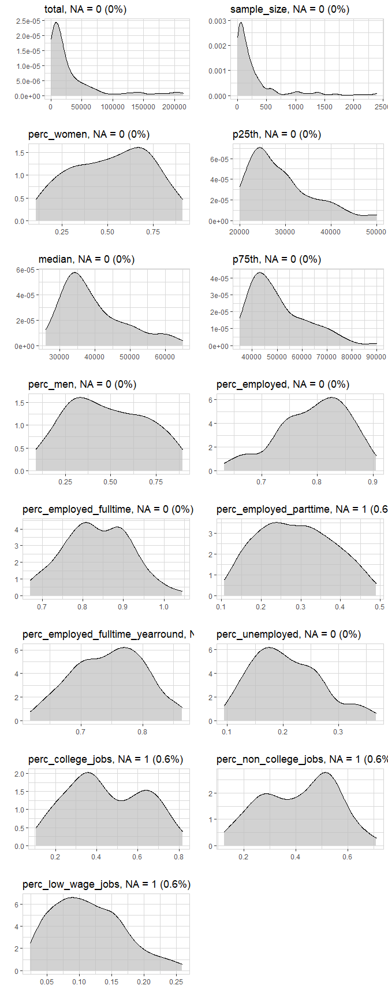
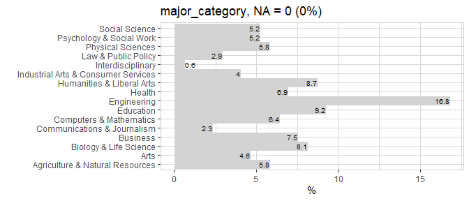
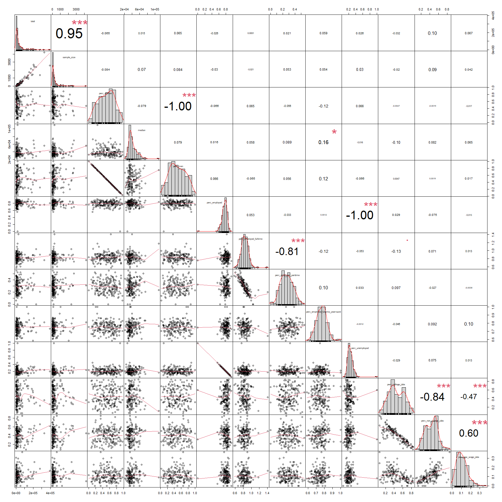
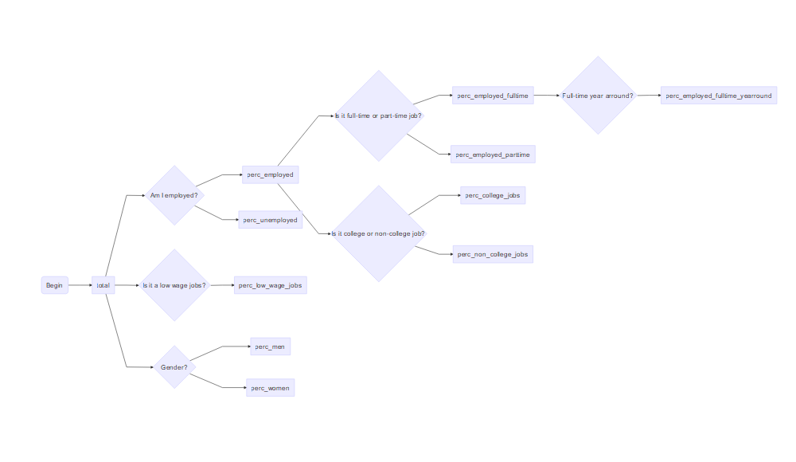
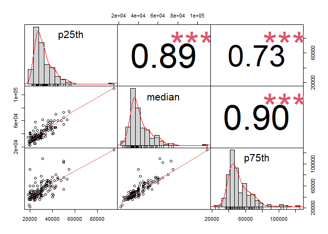
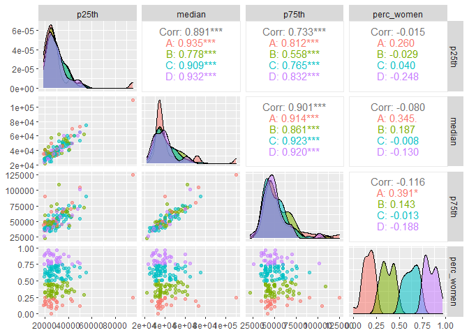

`Practice Quiz` Regression Models
================

-   👨🏻‍💻 Author: Anderson H Uyekita
-   📚 Specialization: <a
    href="https://www.coursera.org/specializations/data-science-foundations-r"
    target="_blank" rel="noopener">Data Science: Foundations using R
    Specialization</a>
-   📖 Course:
    <a href="https://www.coursera.org/learn/regression-models"
    target="_blank" rel="noopener">Regression Models</a>
    -   🧑‍🏫 Instructor: Brian Caffo
-   📆 Week 3
    -   🚦 Start: Saturday, 23 July 2022
    -   🏁 Finish: Monday, 25 July 2022
-   🌎 Rpubs: [Interactive
    Document](https://rpubs.com/AndersonUyekita/course-project_regression-models)

------------------------------------------------------------------------

## Brief Analysis about Manual and Automatic Transmissions

[](https://mybinder.org/v2/gh/AndersonUyekita/regression-models_practice_quiz/main?urlpath=rstudio)

## Synopsis

## 1. Introduction

The Optional Quiz Assignment wants to analyze the relationship between
income and major categories. This study should be performed using the
`college` dataset from the `collegeIncome` library.

## 2. Objectives

This Practice Quiz aims to answer the following question:

> Based on your analysis, would you conclude that there is a significant
> association between college major category and income?

-   [ ] Yes
-   [ ] No

## 3. Requeriments

It is necessary to use the following packages to perform this
experiment.

``` r
# Loading packages
library(collegeIncome)
library(tidyverse)
library(magrittr)
library(ggplot2)
library(explore)
library(kableExtra)
library(DT)
library(PerformanceAnalytics)
library(DiagrammeR)
library(GGally)
```

### 3.1. Reproducibility

If you want to reproduce it, please, fork the experiment repository
hosted on Github.

-   [Github
    Repository](https://github.com/AndersonUyekita/regression-models_practice_quiz)

### 3.2. Loading Data

Following the practice quiz instructions, I have used the `college`
dataset from the `collegeIncome` package.

``` r
# Loading college data to environment.
data("college")

# Creating a copy of college data.
df_college <- college
```

### 3.3. Codebook

From the assignment instructions:

-   rank: Rank by median earnings
-   major_code: Major code
-   major: Major description
-   major_category: Category of major
-   total: Total number of people with major
-   sample_size: Sample size of full-time, year-round individuals used
    for income/earnings estimates: p25th, median, p75th
-   p25th: 25th percentile of earnings
-   median: Median earnings of full-time, year-round workers
-   p75th: 75th percentile of earnings
-   perc_men: % men with major (out of total)
-   perc_women: % women with major (out of total)
-   perc_employed: % employed (out of total)
-   perc_employed_fulltime: % employed 35 hours or more (out of
    employed)
-   perc_employed_parttime: % employed less than 35 hours (out of
    employed)
-   perc_employed_fulltime_yearround: % employed at least 50 weeks and
    at least 35 hours (out of employed and full-time)
-   perc_unemployed: % unemployed (out of employed)
-   perc_college_jobs: % with job requiring a college degree (out of
    employed)
-   perc_non_college_jobs: % with job not requiring a college degree
    (out of employed)
-   perc_low_wage_jobs: % in low-wage service jobs (out of total)

## 4. Exploratory Analysis

### 4.1. Dataset Dimensions

The `college` dataset has 173 observations and 19 variables.

``` r
# Checking the number of observations and variables.
dim(df_college)
```

    ## [1] 173  19

### 4.2. Head

The first 10 rows of the dataset:

<table>
<thead>
<tr>
<th style="text-align:right;">
rank
</th>
<th style="text-align:right;">
major_code
</th>
<th style="text-align:left;">
major
</th>
<th style="text-align:left;">
major_category
</th>
<th style="text-align:right;">
total
</th>
<th style="text-align:right;">
sample_size
</th>
<th style="text-align:right;">
perc_women
</th>
<th style="text-align:right;">
p25th
</th>
<th style="text-align:right;">
median
</th>
<th style="text-align:right;">
p75th
</th>
<th style="text-align:right;">
perc_men
</th>
<th style="text-align:right;">
perc_employed
</th>
<th style="text-align:right;">
perc_employed_fulltime
</th>
<th style="text-align:right;">
perc_employed_parttime
</th>
<th style="text-align:right;">
perc_employed_fulltime_yearround
</th>
<th style="text-align:right;">
perc_unemployed
</th>
<th style="text-align:right;">
perc_college_jobs
</th>
<th style="text-align:right;">
perc_non_college_jobs
</th>
<th style="text-align:right;">
perc_low_wage_jobs
</th>
</tr>
</thead>
<tbody>
<tr>
<td style="text-align:right;">
1
</td>
<td style="text-align:right;">
2419
</td>
<td style="text-align:left;">
Petroleum Engineering
</td>
<td style="text-align:left;">
Engineering
</td>
<td style="text-align:right;">
2339
</td>
<td style="text-align:right;">
36
</td>
<td style="text-align:right;">
0.9109326
</td>
<td style="text-align:right;">
25000
</td>
<td style="text-align:right;">
40000
</td>
<td style="text-align:right;">
50000
</td>
<td style="text-align:right;">
0.0890674
</td>
<td style="text-align:right;">
0.9115044
</td>
<td style="text-align:right;">
0.9206524
</td>
<td style="text-align:right;">
0.1774785
</td>
<td style="text-align:right;">
0.7704431
</td>
<td style="text-align:right;">
0.0884956
</td>
<td style="text-align:right;">
0.6702970
</td>
<td style="text-align:right;">
0.1821782
</td>
<td style="text-align:right;">
0.0554455
</td>
</tr>
<tr>
<td style="text-align:right;">
2
</td>
<td style="text-align:right;">
2416
</td>
<td style="text-align:left;">
Mining And Mineral Engineering
</td>
<td style="text-align:left;">
Engineering
</td>
<td style="text-align:right;">
756
</td>
<td style="text-align:right;">
7
</td>
<td style="text-align:right;">
0.5154064
</td>
<td style="text-align:right;">
26000
</td>
<td style="text-align:right;">
37000
</td>
<td style="text-align:right;">
40000
</td>
<td style="text-align:right;">
0.4845936
</td>
<td style="text-align:right;">
0.7980501
</td>
<td style="text-align:right;">
0.7110092
</td>
<td style="text-align:right;">
0.3623853
</td>
<td style="text-align:right;">
0.7093101
</td>
<td style="text-align:right;">
0.2019499
</td>
<td style="text-align:right;">
0.3867764
</td>
<td style="text-align:right;">
0.5158761
</td>
<td style="text-align:right;">
0.2156017
</td>
</tr>
<tr>
<td style="text-align:right;">
3
</td>
<td style="text-align:right;">
2415
</td>
<td style="text-align:left;">
Metallurgical Engineering
</td>
<td style="text-align:left;">
Engineering
</td>
<td style="text-align:right;">
856
</td>
<td style="text-align:right;">
3
</td>
<td style="text-align:right;">
0.5942076
</td>
<td style="text-align:right;">
26700
</td>
<td style="text-align:right;">
45000
</td>
<td style="text-align:right;">
60000
</td>
<td style="text-align:right;">
0.4057924
</td>
<td style="text-align:right;">
0.7871943
</td>
<td style="text-align:right;">
0.8833498
</td>
<td style="text-align:right;">
0.3387257
</td>
<td style="text-align:right;">
0.7738366
</td>
<td style="text-align:right;">
0.2128057
</td>
<td style="text-align:right;">
0.7289116
</td>
<td style="text-align:right;">
0.1759983
</td>
<td style="text-align:right;">
0.0301483
</td>
</tr>
<tr>
<td style="text-align:right;">
4
</td>
<td style="text-align:right;">
2417
</td>
<td style="text-align:left;">
Naval Architecture And Marine Engineering
</td>
<td style="text-align:left;">
Engineering
</td>
<td style="text-align:right;">
1258
</td>
<td style="text-align:right;">
16
</td>
<td style="text-align:right;">
0.6521298
</td>
<td style="text-align:right;">
26000
</td>
<td style="text-align:right;">
35000
</td>
<td style="text-align:right;">
45000
</td>
<td style="text-align:right;">
0.3478702
</td>
<td style="text-align:right;">
0.8465608
</td>
<td style="text-align:right;">
0.9366337
</td>
<td style="text-align:right;">
0.1673267
</td>
<td style="text-align:right;">
0.6527853
</td>
<td style="text-align:right;">
0.1534392
</td>
<td style="text-align:right;">
0.2460902
</td>
<td style="text-align:right;">
0.4107636
</td>
<td style="text-align:right;">
0.0432383
</td>
</tr>
<tr>
<td style="text-align:right;">
5
</td>
<td style="text-align:right;">
2405
</td>
<td style="text-align:left;">
Chemical Engineering
</td>
<td style="text-align:left;">
Engineering
</td>
<td style="text-align:right;">
32260
</td>
<td style="text-align:right;">
289
</td>
<td style="text-align:right;">
0.4179248
</td>
<td style="text-align:right;">
31500
</td>
<td style="text-align:right;">
62000
</td>
<td style="text-align:right;">
109000
</td>
<td style="text-align:right;">
0.5820752
</td>
<td style="text-align:right;">
0.8515625
</td>
<td style="text-align:right;">
0.8086363
</td>
<td style="text-align:right;">
0.4020061
</td>
<td style="text-align:right;">
0.6852821
</td>
<td style="text-align:right;">
0.1484375
</td>
<td style="text-align:right;">
0.5867515
</td>
<td style="text-align:right;">
0.3860437
</td>
<td style="text-align:right;">
0.1180106
</td>
</tr>
<tr>
<td style="text-align:right;">
6
</td>
<td style="text-align:right;">
2418
</td>
<td style="text-align:left;">
Nuclear Engineering
</td>
<td style="text-align:left;">
Engineering
</td>
<td style="text-align:right;">
2573
</td>
<td style="text-align:right;">
17
</td>
<td style="text-align:right;">
0.4305368
</td>
<td style="text-align:right;">
23000
</td>
<td style="text-align:right;">
44700
</td>
<td style="text-align:right;">
50000
</td>
<td style="text-align:right;">
0.5694632
</td>
<td style="text-align:right;">
0.8474507
</td>
<td style="text-align:right;">
0.8756262
</td>
<td style="text-align:right;">
0.2040405
</td>
<td style="text-align:right;">
0.6567727
</td>
<td style="text-align:right;">
0.1525493
</td>
<td style="text-align:right;">
0.4624782
</td>
<td style="text-align:right;">
0.4057592
</td>
<td style="text-align:right;">
0.2347295
</td>
</tr>
<tr>
<td style="text-align:right;">
7
</td>
<td style="text-align:right;">
6202
</td>
<td style="text-align:left;">
Actuarial Science
</td>
<td style="text-align:left;">
Business
</td>
<td style="text-align:right;">
3777
</td>
<td style="text-align:right;">
51
</td>
<td style="text-align:right;">
0.7989198
</td>
<td style="text-align:right;">
32500
</td>
<td style="text-align:right;">
45000
</td>
<td style="text-align:right;">
58000
</td>
<td style="text-align:right;">
0.2010802
</td>
<td style="text-align:right;">
0.7312457
</td>
<td style="text-align:right;">
0.8282614
</td>
<td style="text-align:right;">
0.2501985
</td>
<td style="text-align:right;">
0.6553030
</td>
<td style="text-align:right;">
0.2687543
</td>
<td style="text-align:right;">
0.5322994
</td>
<td style="text-align:right;">
0.2073186
</td>
<td style="text-align:right;">
0.0410151
</td>
</tr>
<tr>
<td style="text-align:right;">
8
</td>
<td style="text-align:right;">
5001
</td>
<td style="text-align:left;">
Astronomy And Astrophysics
</td>
<td style="text-align:left;">
Physical Sciences
</td>
<td style="text-align:right;">
1792
</td>
<td style="text-align:right;">
10
</td>
<td style="text-align:right;">
0.3250919
</td>
<td style="text-align:right;">
37900
</td>
<td style="text-align:right;">
57000
</td>
<td style="text-align:right;">
67000
</td>
<td style="text-align:right;">
0.6749081
</td>
<td style="text-align:right;">
0.7347429
</td>
<td style="text-align:right;">
0.7929003
</td>
<td style="text-align:right;">
0.3260875
</td>
<td style="text-align:right;">
0.7969084
</td>
<td style="text-align:right;">
0.2652571
</td>
<td style="text-align:right;">
0.6963297
</td>
<td style="text-align:right;">
0.2703369
</td>
<td style="text-align:right;">
0.0674489
</td>
</tr>
<tr>
<td style="text-align:right;">
9
</td>
<td style="text-align:right;">
2414
</td>
<td style="text-align:left;">
Mechanical Engineering
</td>
<td style="text-align:left;">
Engineering
</td>
<td style="text-align:right;">
91227
</td>
<td style="text-align:right;">
1029
</td>
<td style="text-align:right;">
0.0774530
</td>
<td style="text-align:right;">
29200
</td>
<td style="text-align:right;">
36000
</td>
<td style="text-align:right;">
46000
</td>
<td style="text-align:right;">
0.9225470
</td>
<td style="text-align:right;">
0.8333308
</td>
<td style="text-align:right;">
0.7666667
</td>
<td style="text-align:right;">
0.4009259
</td>
<td style="text-align:right;">
0.6668268
</td>
<td style="text-align:right;">
0.1666692
</td>
<td style="text-align:right;">
0.8085868
</td>
<td style="text-align:right;">
0.1198569
</td>
<td style="text-align:right;">
0.0447227
</td>
</tr>
<tr>
<td style="text-align:right;">
10
</td>
<td style="text-align:right;">
2408
</td>
<td style="text-align:left;">
Electrical Engineering
</td>
<td style="text-align:left;">
Engineering
</td>
<td style="text-align:right;">
81527
</td>
<td style="text-align:right;">
631
</td>
<td style="text-align:right;">
0.7799332
</td>
<td style="text-align:right;">
23000
</td>
<td style="text-align:right;">
32200
</td>
<td style="text-align:right;">
47100
</td>
<td style="text-align:right;">
0.2200668
</td>
<td style="text-align:right;">
0.7820819
</td>
<td style="text-align:right;">
0.7615007
</td>
<td style="text-align:right;">
0.3873889
</td>
<td style="text-align:right;">
0.7475654
</td>
<td style="text-align:right;">
0.2179181
</td>
<td style="text-align:right;">
0.6369594
</td>
<td style="text-align:right;">
0.3276540
</td>
<td style="text-align:right;">
0.1441678
</td>
</tr>
</tbody>
</table>

### 4.3. Tail

The last three rows of the dataset:

<table>
<thead>
<tr>
<th style="text-align:left;">
</th>
<th style="text-align:right;">
rank
</th>
<th style="text-align:right;">
major_code
</th>
<th style="text-align:left;">
major
</th>
<th style="text-align:left;">
major_category
</th>
<th style="text-align:right;">
total
</th>
<th style="text-align:right;">
sample_size
</th>
<th style="text-align:right;">
perc_women
</th>
<th style="text-align:right;">
p25th
</th>
<th style="text-align:right;">
median
</th>
<th style="text-align:right;">
p75th
</th>
<th style="text-align:right;">
perc_men
</th>
<th style="text-align:right;">
perc_employed
</th>
<th style="text-align:right;">
perc_employed_fulltime
</th>
<th style="text-align:right;">
perc_employed_parttime
</th>
<th style="text-align:right;">
perc_employed_fulltime_yearround
</th>
<th style="text-align:right;">
perc_unemployed
</th>
<th style="text-align:right;">
perc_college_jobs
</th>
<th style="text-align:right;">
perc_non_college_jobs
</th>
<th style="text-align:right;">
perc_low_wage_jobs
</th>
</tr>
</thead>
<tbody>
<tr>
<td style="text-align:left;">
164
</td>
<td style="text-align:right;">
164
</td>
<td style="text-align:right;">
6102
</td>
<td style="text-align:left;">
Communication Disorders Sciences And Services
</td>
<td style="text-align:left;">
Health
</td>
<td style="text-align:right;">
38279
</td>
<td style="text-align:right;">
95
</td>
<td style="text-align:right;">
0.6661194
</td>
<td style="text-align:right;">
20000
</td>
<td style="text-align:right;">
28000
</td>
<td style="text-align:right;">
40000
</td>
<td style="text-align:right;">
0.3338806
</td>
<td style="text-align:right;">
0.8379318
</td>
<td style="text-align:right;">
0.8935453
</td>
<td style="text-align:right;">
0.1814547
</td>
<td style="text-align:right;">
0.7454167
</td>
<td style="text-align:right;">
0.1620682
</td>
<td style="text-align:right;">
0.3616531
</td>
<td style="text-align:right;">
0.4983868
</td>
<td style="text-align:right;">
0.0473191
</td>
</tr>
<tr>
<td style="text-align:left;">
165
</td>
<td style="text-align:right;">
165
</td>
<td style="text-align:right;">
2307
</td>
<td style="text-align:left;">
Early Childhood Education
</td>
<td style="text-align:left;">
Education
</td>
<td style="text-align:right;">
37589
</td>
<td style="text-align:right;">
342
</td>
<td style="text-align:right;">
0.5051405
</td>
<td style="text-align:right;">
23400
</td>
<td style="text-align:right;">
32000
</td>
<td style="text-align:right;">
38000
</td>
<td style="text-align:right;">
0.4948595
</td>
<td style="text-align:right;">
0.8573367
</td>
<td style="text-align:right;">
0.6563326
</td>
<td style="text-align:right;">
0.4858586
</td>
<td style="text-align:right;">
0.8570560
</td>
<td style="text-align:right;">
0.1426633
</td>
<td style="text-align:right;">
0.6935581
</td>
<td style="text-align:right;">
0.2631236
</td>
<td style="text-align:right;">
0.0967769
</td>
</tr>
<tr>
<td style="text-align:left;">
166
</td>
<td style="text-align:right;">
166
</td>
<td style="text-align:right;">
2603
</td>
<td style="text-align:left;">
Other Foreign Languages
</td>
<td style="text-align:left;">
Humanities & Liberal Arts
</td>
<td style="text-align:right;">
11204
</td>
<td style="text-align:right;">
56
</td>
<td style="text-align:right;">
0.6860244
</td>
<td style="text-align:right;">
24000
</td>
<td style="text-align:right;">
31500
</td>
<td style="text-align:right;">
41000
</td>
<td style="text-align:right;">
0.3139756
</td>
<td style="text-align:right;">
0.7561065
</td>
<td style="text-align:right;">
0.8771686
</td>
<td style="text-align:right;">
0.2456627
</td>
<td style="text-align:right;">
0.7612071
</td>
<td style="text-align:right;">
0.2438935
</td>
<td style="text-align:right;">
0.0689736
</td>
<td style="text-align:right;">
0.2375625
</td>
<td style="text-align:right;">
0.0657657
</td>
</tr>
<tr>
<td style="text-align:left;">
167
</td>
<td style="text-align:right;">
167
</td>
<td style="text-align:right;">
6001
</td>
<td style="text-align:left;">
Drama And Theater Arts
</td>
<td style="text-align:left;">
Arts
</td>
<td style="text-align:right;">
43249
</td>
<td style="text-align:right;">
357
</td>
<td style="text-align:right;">
0.7475609
</td>
<td style="text-align:right;">
35000
</td>
<td style="text-align:right;">
52000
</td>
<td style="text-align:right;">
60000
</td>
<td style="text-align:right;">
0.2524391
</td>
<td style="text-align:right;">
0.8182426
</td>
<td style="text-align:right;">
0.8396818
</td>
<td style="text-align:right;">
0.3511331
</td>
<td style="text-align:right;">
0.6878988
</td>
<td style="text-align:right;">
0.1817574
</td>
<td style="text-align:right;">
0.6408878
</td>
<td style="text-align:right;">
0.2459441
</td>
<td style="text-align:right;">
0.0785309
</td>
</tr>
<tr>
<td style="text-align:left;">
168
</td>
<td style="text-align:right;">
168
</td>
<td style="text-align:right;">
3302
</td>
<td style="text-align:left;">
Composition And Rhetoric
</td>
<td style="text-align:left;">
Humanities & Liberal Arts
</td>
<td style="text-align:right;">
18953
</td>
<td style="text-align:right;">
151
</td>
<td style="text-align:right;">
0.8459344
</td>
<td style="text-align:right;">
30000
</td>
<td style="text-align:right;">
42000
</td>
<td style="text-align:right;">
65000
</td>
<td style="text-align:right;">
0.1540656
</td>
<td style="text-align:right;">
0.7636511
</td>
<td style="text-align:right;">
1.0041209
</td>
<td style="text-align:right;">
0.1016484
</td>
<td style="text-align:right;">
0.7687849
</td>
<td style="text-align:right;">
0.2363489
</td>
<td style="text-align:right;">
0.6798525
</td>
<td style="text-align:right;">
0.2782434
</td>
<td style="text-align:right;">
0.0871606
</td>
</tr>
<tr>
<td style="text-align:left;">
169
</td>
<td style="text-align:right;">
169
</td>
<td style="text-align:right;">
3609
</td>
<td style="text-align:left;">
Zoology
</td>
<td style="text-align:left;">
Biology & Life Science
</td>
<td style="text-align:right;">
8409
</td>
<td style="text-align:right;">
47
</td>
<td style="text-align:right;">
0.7643203
</td>
<td style="text-align:right;">
50000
</td>
<td style="text-align:right;">
65000
</td>
<td style="text-align:right;">
102000
</td>
<td style="text-align:right;">
0.2356797
</td>
<td style="text-align:right;">
0.6757741
</td>
<td style="text-align:right;">
0.8792842
</td>
<td style="text-align:right;">
0.1889597
</td>
<td style="text-align:right;">
0.6058012
</td>
<td style="text-align:right;">
0.3242259
</td>
<td style="text-align:right;">
0.3260464
</td>
<td style="text-align:right;">
0.5193282
</td>
<td style="text-align:right;">
0.0514529
</td>
</tr>
<tr>
<td style="text-align:left;">
170
</td>
<td style="text-align:right;">
170
</td>
<td style="text-align:right;">
5201
</td>
<td style="text-align:left;">
Educational Psychology
</td>
<td style="text-align:left;">
Psychology & Social Work
</td>
<td style="text-align:right;">
2854
</td>
<td style="text-align:right;">
7
</td>
<td style="text-align:right;">
0.8644561
</td>
<td style="text-align:right;">
33000
</td>
<td style="text-align:right;">
46000
</td>
<td style="text-align:right;">
58000
</td>
<td style="text-align:right;">
0.1355439
</td>
<td style="text-align:right;">
0.7932137
</td>
<td style="text-align:right;">
0.9613045
</td>
<td style="text-align:right;">
0.1179815
</td>
<td style="text-align:right;">
0.7406321
</td>
<td style="text-align:right;">
0.2067863
</td>
<td style="text-align:right;">
0.3928227
</td>
<td style="text-align:right;">
0.4748271
</td>
<td style="text-align:right;">
0.1374657
</td>
</tr>
<tr>
<td style="text-align:left;">
171
</td>
<td style="text-align:right;">
171
</td>
<td style="text-align:right;">
5202
</td>
<td style="text-align:left;">
Clinical Psychology
</td>
<td style="text-align:left;">
Psychology & Social Work
</td>
<td style="text-align:right;">
2838
</td>
<td style="text-align:right;">
13
</td>
<td style="text-align:right;">
0.8128766
</td>
<td style="text-align:right;">
22000
</td>
<td style="text-align:right;">
29000
</td>
<td style="text-align:right;">
38000
</td>
<td style="text-align:right;">
0.1871234
</td>
<td style="text-align:right;">
0.8017061
</td>
<td style="text-align:right;">
0.8414807
</td>
<td style="text-align:right;">
0.2807614
</td>
<td style="text-align:right;">
0.7271024
</td>
<td style="text-align:right;">
0.1982939
</td>
<td style="text-align:right;">
0.2131006
</td>
<td style="text-align:right;">
0.5087367
</td>
<td style="text-align:right;">
0.1591581
</td>
</tr>
<tr>
<td style="text-align:left;">
172
</td>
<td style="text-align:right;">
172
</td>
<td style="text-align:right;">
5203
</td>
<td style="text-align:left;">
Counseling Psychology
</td>
<td style="text-align:left;">
Psychology & Social Work
</td>
<td style="text-align:right;">
4626
</td>
<td style="text-align:right;">
21
</td>
<td style="text-align:right;">
0.5847764
</td>
<td style="text-align:right;">
39000
</td>
<td style="text-align:right;">
48000
</td>
<td style="text-align:right;">
58000
</td>
<td style="text-align:right;">
0.4152236
</td>
<td style="text-align:right;">
0.7403101
</td>
<td style="text-align:right;">
0.8203650
</td>
<td style="text-align:right;">
0.2846461
</td>
<td style="text-align:right;">
0.7809422
</td>
<td style="text-align:right;">
0.2596899
</td>
<td style="text-align:right;">
0.3483973
</td>
<td style="text-align:right;">
0.5483503
</td>
<td style="text-align:right;">
0.1990650
</td>
</tr>
<tr>
<td style="text-align:left;">
173
</td>
<td style="text-align:right;">
173
</td>
<td style="text-align:right;">
3501
</td>
<td style="text-align:left;">
Library Science
</td>
<td style="text-align:left;">
Education
</td>
<td style="text-align:right;">
1098
</td>
<td style="text-align:right;">
2
</td>
<td style="text-align:right;">
0.3212961
</td>
<td style="text-align:right;">
22500
</td>
<td style="text-align:right;">
38400
</td>
<td style="text-align:right;">
45000
</td>
<td style="text-align:right;">
0.6787039
</td>
<td style="text-align:right;">
0.8194622
</td>
<td style="text-align:right;">
0.7470044
</td>
<td style="text-align:right;">
0.3622428
</td>
<td style="text-align:right;">
0.6835719
</td>
<td style="text-align:right;">
0.1805378
</td>
<td style="text-align:right;">
0.7803185
</td>
<td style="text-align:right;">
0.1245406
</td>
<td style="text-align:right;">
0.0285831
</td>
</tr>
</tbody>
</table>

### 4.4. Structure

Let’s check the variables’ types.

    ## 'data.frame':    173 obs. of  19 variables:
    ##  $ rank                            : int  1 2 3 4 5 6 7 8 9 10 ...
    ##  $ major_code                      : int  2419 2416 2415 2417 2405 2418 6202 5001 2414 2408 ...
    ##  $ major                           : chr  "Petroleum Engineering" "Mining And Mineral Engineering" "Metallurgical Engineering" "Naval Architecture And Marine Engineering" ...
    ##  $ major_category                  : chr  "Engineering" "Engineering" "Engineering" "Engineering" ...
    ##  $ total                           : int  2339 756 856 1258 32260 2573 3777 1792 91227 81527 ...
    ##  $ sample_size                     : int  36 7 3 16 289 17 51 10 1029 631 ...
    ##  $ perc_women                      : num  0.911 0.515 0.594 0.652 0.418 ...
    ##  $ p25th                           : num  25000 26000 26700 26000 31500 23000 32500 37900 29200 23000 ...
    ##  $ median                          : num  40000 37000 45000 35000 62000 44700 45000 57000 36000 32200 ...
    ##  $ p75th                           : num  50000 40000 60000 45000 109000 50000 58000 67000 46000 47100 ...
    ##  $ perc_men                        : num  0.0891 0.4846 0.4058 0.3479 0.5821 ...
    ##  $ perc_employed                   : num  0.912 0.798 0.787 0.847 0.852 ...
    ##  $ perc_employed_fulltime          : num  0.921 0.711 0.883 0.937 0.809 ...
    ##  $ perc_employed_parttime          : num  0.177 0.362 0.339 0.167 0.402 ...
    ##  $ perc_employed_fulltime_yearround: num  0.77 0.709 0.774 0.653 0.685 ...
    ##  $ perc_unemployed                 : num  0.0885 0.2019 0.2128 0.1534 0.1484 ...
    ##  $ perc_college_jobs               : num  0.67 0.387 0.729 0.246 0.587 ...
    ##  $ perc_non_college_jobs           : num  0.182 0.516 0.176 0.411 0.386 ...
    ##  $ perc_low_wage_jobs              : num  0.0554 0.2156 0.0301 0.0432 0.118 ...

One observes there are problems with variables types:

-   `major`: Should convert it into a category;
-   `major_category`: Should convert it into a category.

Also, some variables are not helpful for the analysis:

-   `rank`: There is no info about how this rank was calculated.
-   `major_code`: The major code is a primary key, so there is no reason
    to use it in a deeper analysis.

### 4.5. Summary

To confirm the presence of NA observations, categorical variables as
characters, and other problems. Let’s print the `summary()`.

    ##       rank       major_code      major           major_category    
    ##  Min.   :  1   Min.   :1100   Length:173         Length:173        
    ##  1st Qu.: 44   1st Qu.:2403   Class :character   Class :character  
    ##  Median : 87   Median :3608   Mode  :character   Mode  :character  
    ##  Mean   : 87   Mean   :3880                                        
    ##  3rd Qu.:130   3rd Qu.:5503                                        
    ##  Max.   :173   Max.   :6403                                        
    ##                                                                    
    ##      total         sample_size       perc_women         p25th      
    ##  Min.   :   124   Min.   :   2.0   Min.   :0.0000   Min.   :18500  
    ##  1st Qu.:  4361   1st Qu.:  39.0   1st Qu.:0.3397   1st Qu.:24000  
    ##  Median : 15058   Median : 130.0   Median :0.5357   Median :27000  
    ##  Mean   : 39168   Mean   : 356.1   Mean   :0.5226   Mean   :29501  
    ##  3rd Qu.: 38844   3rd Qu.: 338.0   3rd Qu.:0.7020   3rd Qu.:33000  
    ##  Max.   :393735   Max.   :4212.0   Max.   :0.9690   Max.   :95000  
    ##                                                                    
    ##      median           p75th           perc_men       perc_employed   
    ##  Min.   : 22000   Min.   : 22000   Min.   :0.03105   Min.   :0.0000  
    ##  1st Qu.: 33000   1st Qu.: 42000   1st Qu.:0.29798   1st Qu.:0.7477  
    ##  Median : 36000   Median : 47000   Median :0.46429   Median :0.8028  
    ##  Mean   : 40151   Mean   : 51494   Mean   :0.47745   Mean   :0.7886  
    ##  3rd Qu.: 45000   3rd Qu.: 60000   3rd Qu.:0.66033   3rd Qu.:0.8410  
    ##  Max.   :110000   Max.   :125000   Max.   :1.00000   Max.   :0.9562  
    ##                                                                      
    ##  perc_employed_fulltime perc_employed_parttime perc_employed_fulltime_yearround
    ##  Min.   :0.5743         Min.   :0.0000         Min.   :0.5857                  
    ##  1st Qu.:0.7741         1st Qu.:0.2090         1st Qu.:0.7009                  
    ##  Median :0.8319         Median :0.2862         Median :0.7484                  
    ##  Mean   :   Inf         Mean   :0.2874         Mean   :0.7476                  
    ##  3rd Qu.:0.8974         3rd Qu.:0.3623         3rd Qu.:0.7896                  
    ##  Max.   :   Inf         Max.   :0.5518         Max.   :1.0000                  
    ##                         NA's   :1                                              
    ##  perc_unemployed   perc_college_jobs perc_non_college_jobs perc_low_wage_jobs
    ##  Min.   :0.04383   Min.   :0.0633    Min.   :0.08278       Min.   :0.00000   
    ##  1st Qu.:0.15899   1st Qu.:0.2974    1st Qu.:0.27995       1st Qu.:0.06957   
    ##  Median :0.19723   Median :0.4160    Median :0.42020       Median :0.10857   
    ##  Mean   :0.21140   Mean   :0.4478    Mean   :0.41498       Mean   :0.11481   
    ##  3rd Qu.:0.25229   3rd Qu.:0.6170    3rd Qu.:0.52756       3rd Qu.:0.15353   
    ##  Max.   :1.00000   Max.   :0.8383    Max.   :0.85364       Max.   :0.36566   
    ##                    NA's   :1         NA's   :1             NA's   :1

### 4.6. Data Visualization

#### 4.6.1. Numeric Variables

The following graph shows a density plot of each numeric variable.

<!-- -->

Unfortunately, some variables have `NA` values, which will be required
to clean them. So, the following observations have one or more `NA`,
`Inf`, or invalid content.

<table>
<thead>
<tr>
<th style="text-align:right;">
rank
</th>
<th style="text-align:right;">
major_code
</th>
<th style="text-align:left;">
major
</th>
<th style="text-align:left;">
major_category
</th>
<th style="text-align:right;">
total
</th>
<th style="text-align:right;">
sample_size
</th>
<th style="text-align:right;">
perc_women
</th>
<th style="text-align:right;">
p25th
</th>
<th style="text-align:right;">
median
</th>
<th style="text-align:right;">
p75th
</th>
<th style="text-align:right;">
perc_men
</th>
<th style="text-align:right;">
perc_employed
</th>
<th style="text-align:right;">
perc_employed_fulltime
</th>
<th style="text-align:right;">
perc_employed_parttime
</th>
<th style="text-align:right;">
perc_employed_fulltime_yearround
</th>
<th style="text-align:right;">
perc_unemployed
</th>
<th style="text-align:right;">
perc_college_jobs
</th>
<th style="text-align:right;">
perc_non_college_jobs
</th>
<th style="text-align:right;">
perc_low_wage_jobs
</th>
</tr>
</thead>
<tbody>
<tr>
<td style="text-align:right;">
17
</td>
<td style="text-align:right;">
2412
</td>
<td style="text-align:left;">
Industrial And Manufacturing Engineering
</td>
<td style="text-align:left;">
Engineering
</td>
<td style="text-align:right;">
18968
</td>
<td style="text-align:right;">
183
</td>
<td style="text-align:right;">
0.5910010
</td>
<td style="text-align:right;">
25000
</td>
<td style="text-align:right;">
35000
</td>
<td style="text-align:right;">
45000
</td>
<td style="text-align:right;">
0.4089990
</td>
<td style="text-align:right;">
0.7964662
</td>
<td style="text-align:right;">
Inf
</td>
<td style="text-align:right;">
NaN
</td>
<td style="text-align:right;">
0.6817269
</td>
<td style="text-align:right;">
0.2035338
</td>
<td style="text-align:right;">
0.2050809
</td>
<td style="text-align:right;">
0.661135
</td>
<td style="text-align:right;">
0.1368572
</td>
</tr>
<tr>
<td style="text-align:right;">
43
</td>
<td style="text-align:right;">
2100
</td>
<td style="text-align:left;">
Computer And Information Systems
</td>
<td style="text-align:left;">
Computers & Mathematics
</td>
<td style="text-align:right;">
36698
</td>
<td style="text-align:right;">
425
</td>
<td style="text-align:right;">
0.7071362
</td>
<td style="text-align:right;">
25000
</td>
<td style="text-align:right;">
32500
</td>
<td style="text-align:right;">
38000
</td>
<td style="text-align:right;">
0.2928638
</td>
<td style="text-align:right;">
0.8306427
</td>
<td style="text-align:right;">
0.8688172
</td>
<td style="text-align:right;">
0.2397849
</td>
<td style="text-align:right;">
0.7822410
</td>
<td style="text-align:right;">
0.1693573
</td>
<td style="text-align:right;">
NaN
</td>
<td style="text-align:right;">
NaN
</td>
<td style="text-align:right;">
NaN
</td>
</tr>
</tbody>
</table>

`Industrial And Manufacturing Engineering` and
`Computer And Information Systems` majors contain invalid values.

#### 4.6.2. Categorical Variables

There is no way to plot a visible graph to `major` because there are 173
categories in this variable. For this reason, I will not plot any graph
for it.

As expected, the `major` variables have 173 unique values, meaning each
row corresponds to a unique major. However, remember that I have not
inspected each `major` name, so I can not ensure if it contains typos or
the same major with different notations.

<!-- -->

The `major_category` variable have 16 categories. Table 1 summarizes all
majors in respect of `total` and `sample_size.`

<table class="table table-striped table-hover table-condensed table-responsive" style="margin-left: auto; margin-right: auto;">
<thead>
<tr>
<th style="text-align:left;">
major_category
</th>
<th style="text-align:right;">
number_major
</th>
<th style="text-align:right;">
total
</th>
<th style="text-align:right;">
sample_size
</th>
</tr>
</thead>
<tbody>
<tr>
<td style="text-align:left;">
Engineering
</td>
<td style="text-align:right;">
29
</td>
<td style="text-align:right;">
537583
</td>
<td style="text-align:right;">
4926
</td>
</tr>
<tr>
<td style="text-align:left;">
Education
</td>
<td style="text-align:right;">
16
</td>
<td style="text-align:right;">
559129
</td>
<td style="text-align:right;">
4742
</td>
</tr>
<tr>
<td style="text-align:left;">
Humanities & Liberal Arts
</td>
<td style="text-align:right;">
15
</td>
<td style="text-align:right;">
713468
</td>
<td style="text-align:right;">
5340
</td>
</tr>
<tr>
<td style="text-align:left;">
Biology & Life Science
</td>
<td style="text-align:right;">
14
</td>
<td style="text-align:right;">
453862
</td>
<td style="text-align:right;">
2317
</td>
</tr>
<tr>
<td style="text-align:left;">
Business
</td>
<td style="text-align:right;">
13
</td>
<td style="text-align:right;">
1302376
</td>
<td style="text-align:right;">
15505
</td>
</tr>
<tr>
<td style="text-align:left;">
Health
</td>
<td style="text-align:right;">
12
</td>
<td style="text-align:right;">
463230
</td>
<td style="text-align:right;">
3914
</td>
</tr>
<tr>
<td style="text-align:left;">
Computers & Mathematics
</td>
<td style="text-align:right;">
11
</td>
<td style="text-align:right;">
299008
</td>
<td style="text-align:right;">
2860
</td>
</tr>
<tr>
<td style="text-align:left;">
Agriculture & Natural Resources
</td>
<td style="text-align:right;">
10
</td>
<td style="text-align:right;">
79981
</td>
<td style="text-align:right;">
1104
</td>
</tr>
<tr>
<td style="text-align:left;">
Physical Sciences
</td>
<td style="text-align:right;">
10
</td>
<td style="text-align:right;">
185479
</td>
<td style="text-align:right;">
1137
</td>
</tr>
<tr>
<td style="text-align:left;">
Psychology & Social Work
</td>
<td style="text-align:right;">
9
</td>
<td style="text-align:right;">
481007
</td>
<td style="text-align:right;">
3180
</td>
</tr>
<tr>
<td style="text-align:left;">
Social Science
</td>
<td style="text-align:right;">
9
</td>
<td style="text-align:right;">
529966
</td>
<td style="text-align:right;">
4581
</td>
</tr>
<tr>
<td style="text-align:left;">
Arts
</td>
<td style="text-align:right;">
8
</td>
<td style="text-align:right;">
357130
</td>
<td style="text-align:right;">
3260
</td>
</tr>
<tr>
<td style="text-align:left;">
Industrial Arts & Consumer Services
</td>
<td style="text-align:right;">
7
</td>
<td style="text-align:right;">
229792
</td>
<td style="text-align:right;">
2165
</td>
</tr>
<tr>
<td style="text-align:left;">
Law & Public Policy
</td>
<td style="text-align:right;">
5
</td>
<td style="text-align:right;">
179107
</td>
<td style="text-align:right;">
1935
</td>
</tr>
<tr>
<td style="text-align:left;">
Communications & Journalism
</td>
<td style="text-align:right;">
4
</td>
<td style="text-align:right;">
392601
</td>
<td style="text-align:right;">
4508
</td>
</tr>
<tr>
<td style="text-align:left;">
Interdisciplinary
</td>
<td style="text-align:right;">
1
</td>
<td style="text-align:right;">
12296
</td>
<td style="text-align:right;">
128
</td>
</tr>
</tbody>
</table>

Highlights:

-   `Interdisciplinary` corresponds to 0.6% of total major courses. In
    absolute terms, this category has only one major course
    (`Multi/Interdisciplinary Studies`);
-   Due to the `size_sample` and `total` of the `Interdisciplinary`
    category, it is convenient to remove it.
-   `Engineering` is the `major_category` with the most number of
    majors, and;
-   `Business` is the `major_category` with the most number of
    students..

#### 4.6.3. Variables Correlation

I will show the scatter plot with histogram and correlation between each
variable.

<!-- -->

Highlights:

-   `total` and `sample_size` have a high correlation because the
    greater the number of people with that major, the greater the
    sample_size. It is necessary to drop one out of two;
-   `perc_women` and `perc_men` have a perfect correlation, which is
    expected because they are complementary;
-   `perc_employed` and `perc_unemployed` also have a perfect
    correlation, which is expected because they are complementary;
-   `perc_employed_fulltime` and `perc_employed_parttime` have high
    correlation. Given that you are employed, you only have two options,
    full-time or part-time, so those variables are also complementary;
-   `perc_college_jobs` and `perc_non_college_jobs` have high
    correlation. Given that you are employed, you only have two options
    to the job type, college or non-college, so those variables are also
    complementary, and;
-   `perc_low_wage_jobs` is positive correlated with
    `perc_non_college_jobs` and negative correlated with
    `perc_college_jobs` because it is expected that college jobs has
    greater payloads in comparison to non-college jobs, and.

## 5. Model Selection

Based on section 4, Exploratory Data Analysis, there are several
variables that I cannot use in the Model Selection due to a high
correlation. For this reason, I will drop the following variables:

-   `rank`;
-   `major_code`;
-   `major`;
-   `sample_size`;
-   `perc_men`;
-   `perc_unemployed`;
-   `perc_employed_fulltime`;
-   `perc_college_jobs`;
-   `p25th`, and;
-   `p75th`.

The figure below shows the variable relationship.

<!-- -->

### 5.1. Data Manipulation

To convert the `college` dataset into a tidy dataset, it is mandatory
to:

-   Subset the college dataset by selecting the variables:
    `major_category`, `total`, `perc_women`, `median`, `perc_employed`,
    `perc_employed_parttime`, `perc_employed_fulltime_yearround`,
    `perc_non_college_jobs`, and `perc_low_wage_jobs`;
-   Converting misclassified variables as characters into factors;
-   Removing `NA` observations, and;
-   Removing non-representative categories.

The tidy dataset has 9 variables and 170 observations.

``` r
# Checking the tidy dataset dimensions.
dim(df_tidy)
```

    ## [1] 170  11

I will count the NA values using the `is.na()` function to ensure I have
eliminated them.

``` r
# Testing
sum(is.na(df_tidy))
```

    ## [1] 0

It is zero, which means there are no `NA` values.

### 5.2. 25th, 50th or 75th Percentile

Regardless of the dependent variable used as output, the three options
have a high correlation. So, the figure below will show the correlation
matrix between the 25th, 50th, and 75th percentile.

<!-- -->

Highlight:

-   `p25th`, `median`, and `p75th` are strongly positively correlated.

Any of those used as the dependent variables will perform similar
outcomes.

### 5.3. Gender Income Gap

According to the Bureau of Labor Statistics, the income gap between men
and women is around 62 USD per week. Let’s divide the women penetration
in a given major category into 4 levels:

-   Category A: `perc_women` below 25%;
-   Category B: `perc_women` between 25% and 50%;
-   Category C: `perc_women` between 50% and 75%, and;
-   Category D: `perc_women` above 25%.

<!-- -->

The above graph shows no difference between high women penetration in
the yearly income, which is a bit counter-intuitive due to the
well-known gap between men’s and women’s wages. Moreover, all density
curves are barely the same or with minor changes.

### 5.4. Linear Regression

Considering income is directly related to how much time you spend
working, the `perc_employed_fulltime_yearround` will play a key role.
Also, people who does not work in college jobs (`perc_non_college_jobs`)
will have a lower wage, which is also related to `perc_low_wage_jobs`.
From the section 5.3. Gender Income Gap, I will drop the gender variable
(`perc_women`).


    ##                                                     Estimate Std. Error t value
    ## major_categoryAgriculture & Natural Resources     13230.9994  10328.471  1.2810
    ## major_categoryArts                                 5867.2472  11041.329  0.5314
    ## major_categoryBiology & Life Science              13137.8395  10212.755  1.2864
    ## major_categoryBusiness                            19560.0748   9904.361  1.9749
    ## major_categoryCommunications & Journalism         10454.2052  11535.425  0.9063
    ## major_categoryComputers & Mathematics              2211.8554  10943.045  0.2021
    ## major_categoryEducation                            7240.4506  10223.697  0.7082
    ## major_categoryEngineering                          9661.4590  10176.620  0.9494
    ## major_categoryHealth                               8751.5405  10539.399  0.8304
    ## major_categoryHumanities & Liberal Arts            3793.9222  10354.490  0.3664
    ## major_categoryIndustrial Arts & Consumer Services  8252.8659  11143.581  0.7406
    ## major_categoryLaw & Public Policy                  7279.2157  10909.618  0.6672
    ## major_categoryPhysical Sciences                    9430.2765  10511.430  0.8971
    ## major_categoryPsychology & Social Work             7813.1995  10779.438  0.7248
    ## major_categorySocial Science                       8027.8700  10731.857  0.7480
    ## perc_employed_fulltime_yearround                  37822.5392  13212.248  2.8627
    ## perc_non_college_jobs                              6962.2952   7295.501  0.9543
    ## perc_low_wage_jobs                                 -488.2877  17594.752 -0.0278
    ##                                                   Pr(>|t|)
    ## major_categoryAgriculture & Natural Resources       0.2021
    ## major_categoryArts                                  0.5959
    ## major_categoryBiology & Life Science                0.2003
    ## major_categoryBusiness                              0.0501
    ## major_categoryCommunications & Journalism           0.3662
    ## major_categoryComputers & Mathematics               0.8401
    ## major_categoryEducation                             0.4799
    ## major_categoryEngineering                           0.3439
    ## major_categoryHealth                                0.4076
    ## major_categoryHumanities & Liberal Arts             0.7146
    ## major_categoryIndustrial Arts & Consumer Services   0.4601
    ## major_categoryLaw & Public Policy                   0.5056
    ## major_categoryPhysical Sciences                     0.3711
    ## major_categoryPsychology & Social Work              0.4697
    ## major_categorySocial Science                        0.4556
    ## perc_employed_fulltime_yearround                    0.0048
    ## perc_non_college_jobs                               0.3414
    ## perc_low_wage_jobs                                  0.9779

From the above results of the `lm()` function, there is no statistical
evidence that `perc_employed_fulltime_yearround`,
`perc_non_college_jobs`, `perc_low_wage_jobs`, and the dummy variable
`major_category` affect the income. Almost all p-value failed to reject
the

hypothesis.

## 6. Results

The answer to the posed question is: There is **no** significant
association between college and major category and income.
